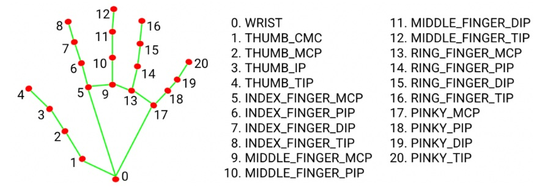
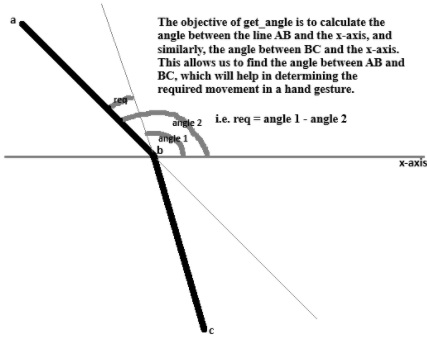

# 🖱️ Virtual Mouse Using Hand Gestures with MediaPipe and OpenCV

This project implements a **virtual mouse controller** using your hand gestures, powered by **MediaPipe**, **OpenCV**, **PyAutoGUI**, and **Pynput**. The system captures real-time webcam video to detect and analyze hand landmarks to perform actions such as moving the mouse, left click, right click, double click, and taking a screenshot — all using intuitive gestures.

---

## 🛠️ Libraries Used

| Library       | Purpose |
|---------------|---------|
| `opencv-python` | Capture and display webcam video; render hand landmark overlay |
| `mediapipe`     | Real-time hand detection and tracking |
| `pyautogui`     | Programmatically control mouse pointer and perform actions |
| `pynput`        | For simulating mouse click actions |
| `numpy`         | Mathematical calculations for angle and distance |
| `random`        | To generate random label for screenshot files |

---

## 📷 How it Works

- **MediaPipe** detects **21 hand landmarks** in real-time.
- Gestures are recognized based on:
  - **Angle between joints**
  - **Distance between landmarks**
- These gestures are then mapped to mouse functions such as:
  - **Move cursor**
  - **Left click**
  - **Right click**
  - **Double click**
  - **Take screenshot**

---

## 🧠 Gesture Detection Explanation

- Full MediaPipe hand landmark map:
  

- **Angles between fingers** help differentiate gestures.
- For example, `get_angle()` computes the angle between three landmarks (A-B-C).
  


---

## ✋ Gesture-to-Action Mapping

| Gesture Description | Action |
|---------------------|--------|
| Index finger pointing (other fingers curled) | Move mouse |
| Index finger up + thumb away + other fingers curled | Left click |
| Middle finger up + thumb away + other fingers curled | Right click |
| Index + middle fingers up + thumb away | Double click |
| Index + thumb far apart + specific fingers close together | Screenshot |

> Example image:  
> 

---

## 🧪 Setup Instructions

### 🔧 1. Create and Activate Virtual Environment

```bash
python -m venv myenv
myenv\Scripts\activate     # For Windows
# source myenv/bin/activate   # For macOS/Linux
````

### 📦 2. Install Requirements

```bash
pip install -r requirements.txt
```

### Requirements (`requirements.txt`)

```
opencv-python
mediapipe==0.10.0
pyautogui
pynput
numpy
```

> **Note:** Use **Python 3.10** for full compatibility with MediaPipe.

---

## ▶️ Run the Project

```bash
python virtual_mouse.py
```

Press `q` to quit the webcam window.

---

## 📹 Demo Video

[](https://www.youtube.com/watch?v=VIDEO_ID_HERE)

---

## 📁 File Structure

```
virtual-mouse-gesture/
│
├── virtual_mouse.py              # Main application logic
├── util.py                       # Helper functions: angle & distance
├── fun_get_angle.jpg             # Image illustrating angle detection
├── mediapipehandgesture.jpeg     # MediaPipe hand landmark diagram
├── gesture_to_action_map.jpg     # Custom image mapping gestures to actions
├── requirements.txt              # All dependencies
└── README.md                     # You're reading it!
```

---

## 🧠 Concepts Highlighted

* **Computer Vision** with OpenCV
* **Hand Pose Estimation** with MediaPipe
* **Euclidean Distance** and **Angle Calculation**
* **Gesture Recognition**
* **System Automation**

---

## 💬 CLI Commands Reference

| Command                           | Purpose                        |
| --------------------------------- | ------------------------------ |
| `python -m venv myenv`            | Create virtual environment     |
| `myenv\Scripts\activate`          | Activate environment (Windows) |
| `pip install -r requirements.txt` | Install dependencies           |
| `python virtual_mouse.py`         | Run the project                |
| Press `q`                         | Quit webcam viewer             |

---

## 🤝 Contributions

Feel free to open issues or submit pull requests. Any improvements or gesture additions are welcome!

---


### 🚀 Happy Coding and Gesture-Controlling! 👋
